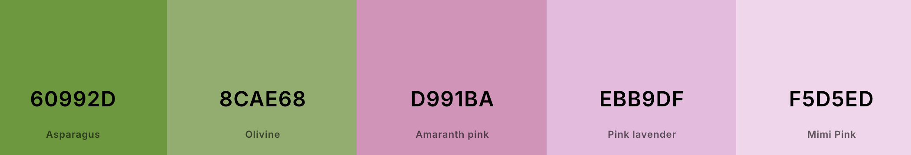
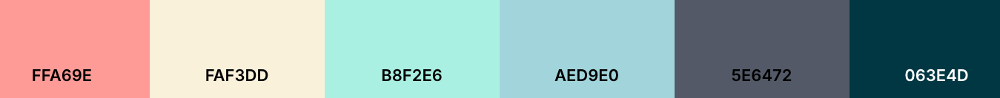

# colour-themes
My personal collection of dark and light themes.

## usage
#### Install

In your target project, run

```bash
$ npm install git+https://github.com/jianninetorres/colour-themes.git
```

#### Import
In your global.css (or tailwind.css, styles.css, etc):

```css
@import 'colour-themes/light/<theme-name>.css';
@import 'colour-themes/dark/<theme-name>.css';
```

Light themes target `:root,
:root[data-theme="light"]`.

Dark themes target `:root[data-theme="dark"]`.

These themes do not set styles for code blocks. You will need to define the `pre code span` styles yourself within each `:root[data-theme=""]`.

Both themes set the `:root` base themes:

```css
:root {
    --theme-bg: var(--bg-hue) var(--bg-saturation) var(--bg-brightness);
    --theme-fg: var(--fg-hue) var(--fg-saturation) var(--fg-brightness);

    --theme-color-900: hsl(var(--theme-fg) / 1);
    --theme-color-850: hsl(var(--theme-fg) / 0.9675);
    --theme-color-800: hsl(var(--theme-fg) / 0.935);
    --theme-color-750: hsl(var(--theme-fg) / 0.88);
    --theme-color-700: hsl(var(--theme-fg) / 0.825);
    --theme-color-650: hsl(var(--theme-fg) / 0.785);
    --theme-color-600: hsl(var(--theme-fg) / 0.745);
    --theme-color-550: hsl(var(--theme-fg) / 0.675);
    --theme-color-500: hsl(var(--theme-fg) / 0.605);
    --theme-color-450: hsl(var(--theme-fg) / 0.5);
    --theme-color-400: hsl(var(--theme-fg) / 0.395);
    --theme-color-350: hsl(var(--theme-fg) / 0.29);
    --theme-color-300: hsl(var(--theme-fg) / 0.185);
    --theme-color-250: hsl(var(--theme-fg) / 0.15);
    --theme-color-200: hsl(var(--theme-fg) / 0.115);
    --theme-color-150: hsl(var(--theme-fg) / 0.08);
    --theme-color-100: hsl(var(--theme-fg) / 0.045);
    --theme-color-75: hsl(var(--theme-fg) / 0.03375);
    --theme-color-50: hsl(var(--theme-fg) / 0.0225);

    --code-inline-bg: var(--theme-color-150);
    --code-bg: var(--theme-special);
    --code-title-bg: var(--theme-color-200);
    --code-line-highlight: var(--theme-color-150);
    --code-line-diff-add: rgba(72, 191, 145, 0.15);
    --code-line-diff-remove: rgba(248, 85, 82, 0.15);
}
```

## Production-ready
#### dark
- [ ] Cosmic Coast
- [ ] Jungle Nocturne
- [x] Morning Nautica
- [ ] Twilight Reverie
- [ ] Midnight Ember

#### light
- [ ] Blushing Grove
- [ ] Daydream Pop
- [ ] Verdant Alloy
- [x] Pastel Tides
 
## themes
### dark

Cosmic Coast


Jungle Nocturne


Morning Nautica


Twilight Reverie


Midnight Ember


### light

Blushing Grove


Daydream Pop


Verdant Alloy


Pastel Tides

